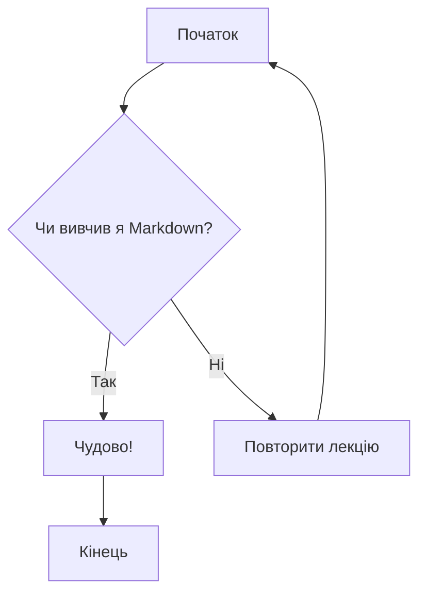
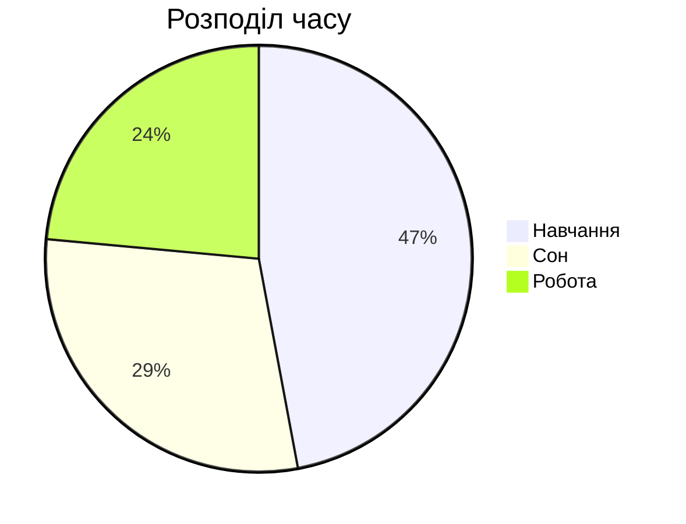

# Інтерактивна лекція: Повний курс по Markdown

## 1. Вступ: Що таке Markdown і навіщо він потрібен?

**Markdown** — це проста мова розмітки, створена у 2004 році Джоном Грубером. Її головна мета — дати можливість писати форматований текст, використовуючи легкий для читання та написання синтаксис, який потім можна легко перетворити на HTML та багато інших форматів.

**Ключова філософія:** фокус на **змісті**, а не на зовнішньому вигляді. Ви не відволікаєтесь на кнопки та меню під час написання — ви просто пишете, позначаючи структуру тексту.

### Markdown vs. MS Word: Ключові переваги

| Критерій | Markdown | MS Word |
| :--- | :--- | :--- |
| **Формат файлу** | `.md` (простий текст) | `.docx` (складний бінарний формат) |
| **Портативність** | **Максимальна.** Відкривається будь-яким текстовим редактором. | **Обмежена.** Потребує спеціалізованого ПЗ. |
| **Контроль версій (Git)** | **Ідеально.** Git відстежує зміни в кожному рядку. | **Жахливо.** Git бачить файл як єдиний об'єкт і не показує, *що саме* змінилося. |
| **Розмір файлу** | Дуже малий. | Значно більший через вбудовані стилі. |

---

## 2. Базовий синтаксис

### Заголовки

**Приклад коду:**

```markdown
# Це заголовок 1 рівня
## Це заголовок 2 рівня
### Це заголовок 3 рівня
```

**Результат:**
# Це заголовок 1 рівня
## Це заголовок 2 рівня
### Це заголовок 3 рівня

---

### Виділення тексту

**Приклад коду:**

```markdown
*Цей текст буде курсивним*  
**Цей текст буде жирним**  
~~А цей буде закресленим~~  
```

**Результат:**

*Цей текст буде курсивним*  
**Цей текст буде жирним**  
~~А цей буде закресленим~~  

---

### Списки

**Приклад коду:**

```markdown
- Перший елемент маркованого списку
- Другий елемент
  - Вкладений елемент

1. Перший елемент нумерованого списку
2. Другий елемент
```

**Результат:**

- Перший елемент маркованого списку
- Другий елемент
  - Вкладений елемент

1. Перший елемент нумерованого списку
2. Другий елемент

---

### Посилання та зображення

**Приклад коду:**

```markdown
[Це посилання на Google](https://www.google.com)


```

**Результат:**

[Це посилання на Google](https://www.google.com)


---

### Цитати та лінії

**Приклад коду:**

```markdown
> Це блок цитати. Дуже зручно для виділення важливих думок.

---
```

**Результат:**
> Це блок цитати. Дуже зручно для виділення важливих думок.

---

### Вставка коду

**Приклад коду:**

````markdown
В тексті можна згадати функцію `print()`.

```python
def greet(name):
    print(f"Hello, {name}!")

greet("World")
```
````

**Результат:**

В тексті можна згадати функцію `print()`.

```python
def greet(name):
    print(f"Hello, {name}!")

greet("World")
```

---

## 3. Розширені можливості

### Таблиці

**Приклад коду:**

```markdown
| Персонаж | Актор/Акторка |
| :--- | :--- |
| Тоні Старк | Роберт Дауні мол. |
| Ар'я Старк | Мейсі Вільямс |
```

**Результат:**

| Персонаж | Актор/Акторка |
| :--- | :--- |
| Тоні Старк | Роберт Дауні мол. |
| Ар'я Старк | Мейсі Вільямс |

### Списки завдань

**Приклад коду:**

```markdown
- [x] Вивчити базовий синтаксис
- [ ] Створити свою першу таблицю
```

**Результат:**

- [x] Вивчити базовий синтаксис
- [ ] Створити свою першу таблицю

---

## 4. Магія: Формули та діаграми

**Важливо:** Відображення формул та діаграм підтримується не всіма редакторами Markdown. Це розширені функції, які чудово працюють в таких інструментах, як **VS Code** (з плагінами), **Obsidian**, а також на **GitHub** та **GitLab**.

### Математичні формули (LaTeX)

**LaTeX** — це стандарт для написання наукових документів. Markdown може відображати формули, написані синтаксисом LaTeX. Рядкові формули обрамляються знаком `$`, блокові — `$$`.

**Приклад коду:**

```markdown
Формула Ейлера: $$e^{i\pi} + 1 = 0$$
Квадратне рівняння: $ax^2 + bx + c = 0$
```

**Результат:**

Формула Ейлера: $$e^{i\pi} + 1 = 0$$
Квадратне рівняння: $ax^2 + bx + c = 0$

### Діаграми (Mermaid)

**Mermaid.js** — це інструмент, який перетворює текстовий опис на діаграми.

**Приклад коду (блок-схема):**

````markdown

````

**Результат (блок-схема):**


**Приклад коду (кругова діаграма):**

````markdown

````

**Результат (кругова діаграма):**


---

## 5. Екосистема: Де використовується Markdown?

- **Розробка (GitHub, GitLab):** `README.md` файли, опис завдань (Issues) та запитів на злиття (Pull Requests).
- **Нотатки (Obsidian, Notion):** Створення персональних баз знань.
- **Статичні сайти (Jekyll, Hugo):** Написання постів для блогів та статей.
- **Месенджери (Telegram, Slack, Discord):** Базове форматування повідомлень.

---
