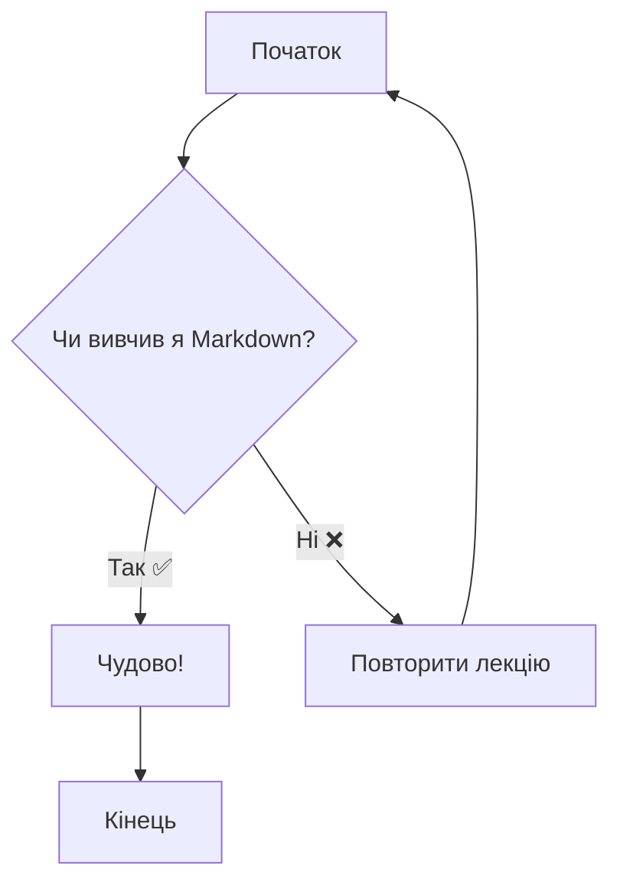
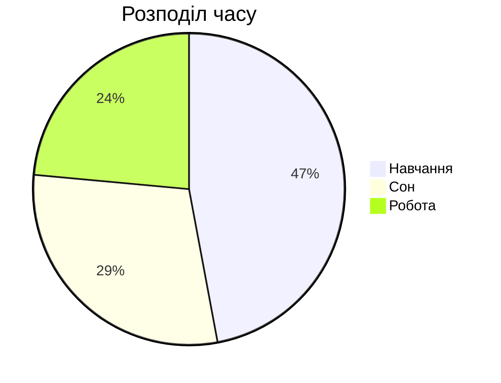
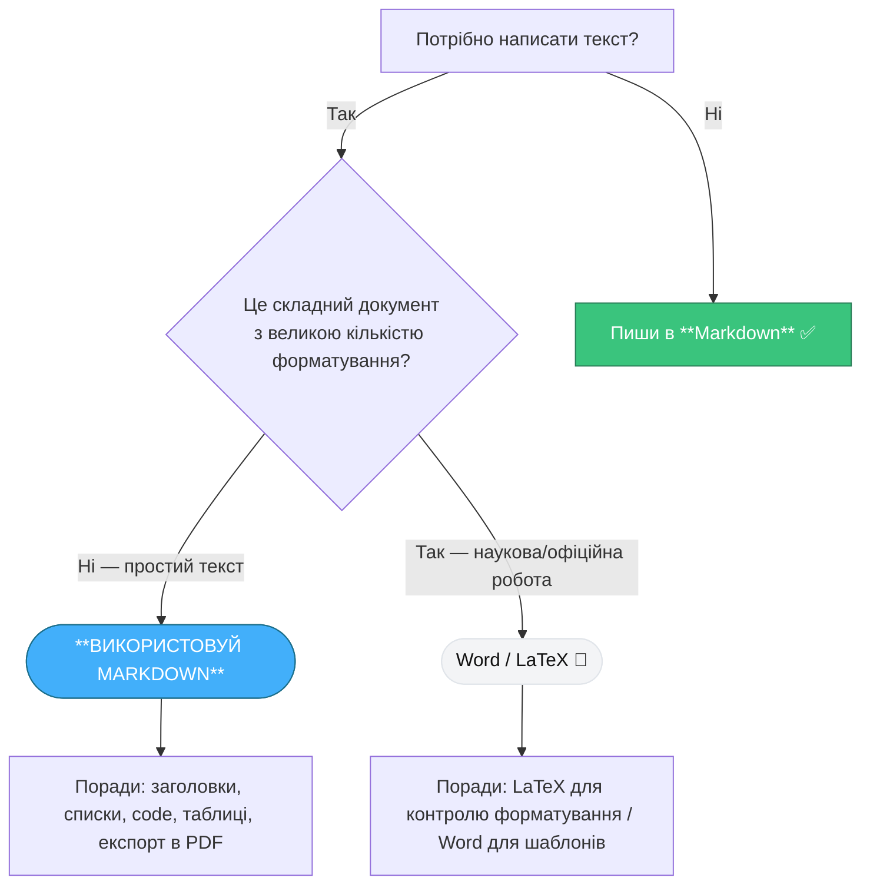

# Інтерактивна лекція: Повний курс по Markdown

## 1. Вступ: Що таке Markdown і навіщо він потрібен?

**Markdown** — це проста мова розмітки, створена у 2004 році Джоном Грубером. Її головна мета — дати можливість писати форматований текст, використовуючи легкий для читання та написання синтаксис. Написаний вами текст потім легко перетворюється на HTML, PDF, та багато інших форматів.

**Ключова філософія:** фокус на **змісті**, а не на зовнішньому вигляді. Ви не відволікаєтесь на кнопки та меню під час написання — ви просто пишете, позначаючи структуру тексту.

### Чому Markdown настільки популярний?

- **Простота:** Синтаксис інтуїтивно зрозумілий і легко запам'ятовується.
- **Швидкість:** Ви форматуєте текст, не відриваючи рук від клавіатури.
- **Портативність:** Файли `.md` — це звичайний текст, який можна відкрити будь-де.
- **Сумісність:** Ідеально працює з системами контролю версій, як-от Git.

### Markdown vs. MS Word: Ключові переваги

| Критерій | Markdown | MS Word |
| :--- | :--- | :--- |
| **Формат файлу** | `.md` (простий текст) | `.docx` (складний бінарний формат) |
| **Портативність** | **Максимальна.** Відкривається будь-яким текстовим редактором. | **Обмежена.** Потребує спеціалізованого ПЗ. |
| **Контроль версій (Git)** | **Ідеально.** Git відстежує зміни в кожному рядку. | **Жахливо.** Git бачить файл як єдиний об'єкт. |
| **Розмір файлу** | Дуже малий. | Значно більший через вбудовані стилі. |
| **Ідеальний для...** | Документації, нотаток, блогів, README файлів. | Складних звітів, офіційних документів. |

---

## 2. Базовий синтаксис

### Заголовки

Використовуйте `#` для створення заголовків. Кількість символів `#` відповідає рівню заголовка (від 1 до 6).

**Приклад коду:**

```markdown
# Заголовок 1 рівня
## Заголовок 2 рівня
### Заголовок 3 рівня
```

---

### Виділення тексту

**Приклад коду:**

```markdown
*Цей текст буде курсивним* (або _ось так_)
**Цей текст буде жирним** (або __ось так__)
~~А цей буде закресленим~~
***Жирний курсив***
```

---

### Списки

**Маркований (невпорядкований):**

```markdown
- Перший елемент
- Другий елемент
  - Вкладений елемент (зробіть відступ)
```

**Нумерований (впорядкований):**

```markdown
1. Перший елемент
2. Другий елемент
3. Третій елемент
```

---

### Посилання та зображення

**Посилання:**

```markdown
[Це посилання на Google](https://www.google.com "Це підказка, яка з'явиться при наведенні")
```

**Результат:** [Це посилання на Google](https://www.google.com "Це підказка, яка з'явиться при наведенні")

**Зображення:**

```markdown

```

**Результат:** 

---

### Цитати та горизонтальні лінії

**Цитата:**

```markdown
> Це блок цитати. Дуже зручно для виділення важливих думок.
> > Вкладена цитата.
```

**Горизонтальна лінія** (для розділення секцій):

```markdown
---
***
___
```

---

### Вставка коду

**Рядковий код:** `print("Hello, World!")`

```markdown
В тексті можна згадати функцію `print()`.
```

**Блок коду** (з підсвіткою синтаксису):

````markdown
```python
def greet(name):
    print(f"Hello, {name}!")

greet("World")
```
````

---

## 3. Розширений синтаксис

### Таблиці

```markdown
| Персонаж | Актор/Акторка | Вирівнювання |
| :--- | :---: | ---: |
| Тоні Старк | Роберт Дауні мол. | Справа |
| Ар'я Старк | Мейсі Вільямс | Справа |
```

> **Пояснення:** Двокрапка (`:`) у рядку форматування контролює вирівнювання тексту в стовпці (`:---` — ліворуч, `:---:` — по центру, `---:` — праворуч).

### Списки завдань (Task Lists)

```markdown
- [x] Вивчити базовий синтаксис
- [ ] Створити свою першу таблицю
- [ ] Опанувати діаграми Mermaid
```

---

## 4. Корисні поради

### 1. Важливість порожніх рядків

Завжди залишайте порожній рядок між різними елементами Markdown (наприклад, між абзацом і списком). Це допомагає уникнути проблем з форматуванням.

### 2. Екранування символів

Що робити, якщо вам потрібно відобразити символ, який використовується в синтаксисі Markdown? Використовуйте зворотний слеш (`\`).

**Приклад:**

```markdown
Я хочу написати \*зірочку\*, а не курсив.
```

**Результат:** Я хочу написати \*зірочку\*, а не курсив.

### 3. Використовуйте лінтери

**Markdownlint** — це інструмент (доступний як плагін для VS Code та інших редакторів), який перевіряє ваш Markdown на відповідність правилам і допомагає писати чистий та консистентний код.

---

## 5. Магія: Формули та діаграми

### Математичні формули (LaTeX)

Рядкові формули обрамляються знаком `$`, блокові — `$$`.

**Приклад коду:**

```markdown
Формула Ейлера: $$e^{i\pi} + 1 = 0$$
Квадратне рівняння: $ax^2 + bx + c = 0$
```

### Діаграми (Mermaid)

**Mermaid.js** — це інструмент, який перетворює текстовий опис на діаграми та графіки.

**Приклад коду (блок-схема):**

````markdown

````


````markdown

````


---

## 6. Екосистема: Де використовується Markdown?

- **Розробка (GitHub, GitLab):** `README.md` файли, опис завдань (Issues) та запитів на злиття (Pull Requests).
- **Нотатки (Obsidian, Notion, Joplin):** Створення персональних баз знань.
- **Статичні сайти (Jekyll, Hugo):** Написання постів для блогів та статей.
- **Месенджери (Telegram, Slack, Discord):** Базове форматування повідомлень.

---

## 7. Висновок та практичне завдання

### Висновок

Markdown — це не просто мова розмітки, а потужний інструмент для підвищення продуктивності. Він дозволяє зосередитись на змісті, легко керувати версіями документів та працювати на будь-якій платформі.

### Практичне завдання

Створіть файл `practice.md` та опишіть у ньому свій улюблений фільм, використовуючи:

1. Заголовок 1-го рівня з назвою.
2. Короткий опис у вигляді цитати.
3. **Жирний** та *курсивний* текст.
4. Маркований список головних героїв.
5. Нумерований список причин, чому він вам подобається.
6. Таблицю з персонажами та акторами.  
7. Посилання на трейлер на YouTube.


